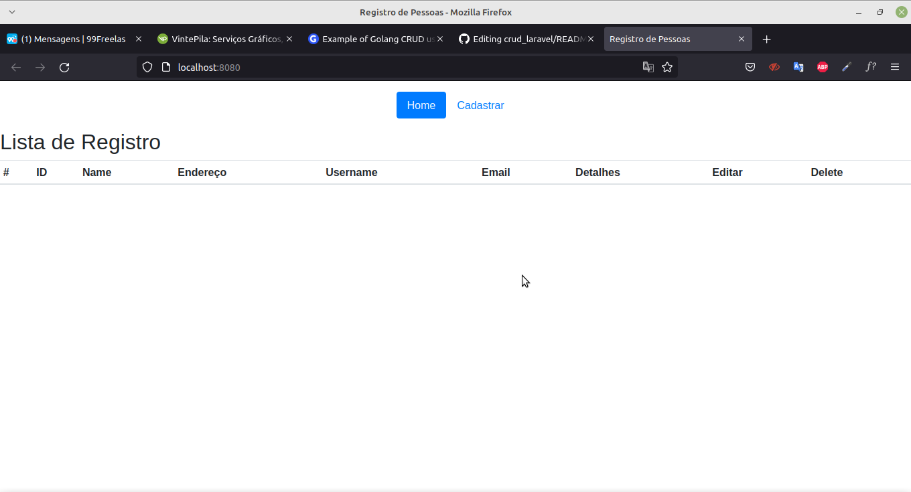
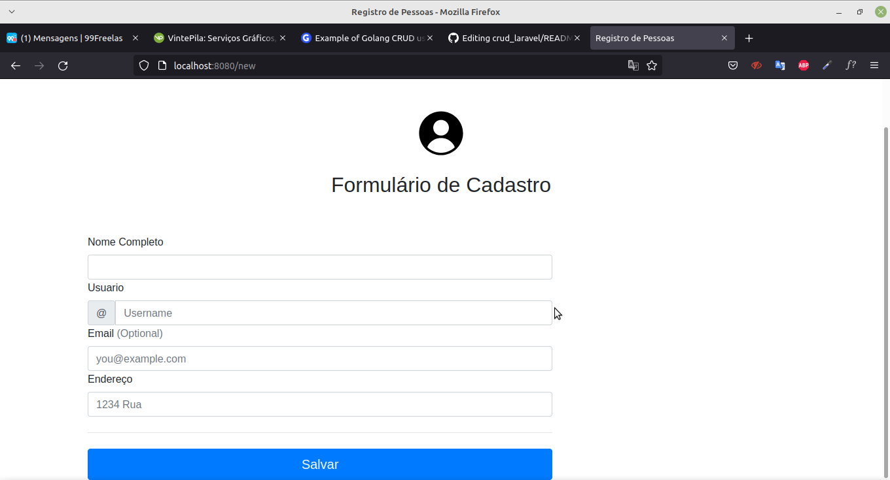
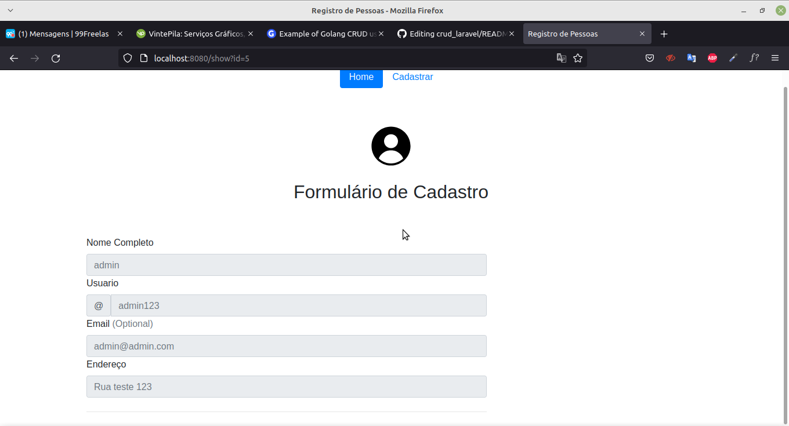
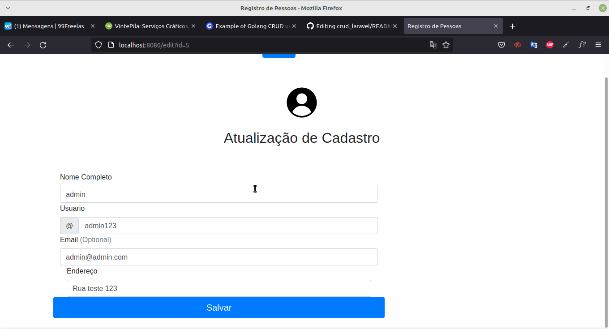

# CRUD EM GO

##  Cadastro de usuários.

### ✅ Features

- Cadastro de usuário;
- Visualização de usuário;
- Editar usuário;
- Apagar usuário;

### ✅ Demonstração da aplicação

Tela Inicial
<h1 align="center">
  
</h1>
Tela de Cadastro
<h1 align="center">
  
</h1>
Cadastro Salvo
<h1 align="center">
  
</h1>
Detalhes
<h1 align="center">
  
</h1>
Editar
<h1 align="center">
  
</h1>

<video width="320" height="240" controls>
  <source src="./assets/video.mkv" type="video/mp4">
</video>

### Rodando o Back End (servidor)

### Execute as migrações do banco

Disponivel no arquivo banco.sql

### Execute a aplicação
go run main.go

# Para o servidor inciar acesse: <http://localhost:8080/>

### 🛠 Tecnologias

As seguintes ferramentas foram usadas na construção do projeto:

- [GoLand](https://www.jetbrains.com/pt-br/go/)
- [Bootstrap](https://getbootstrap.com/)

### Banco de dados
Foi utilizado banco de dados MySQL
Campos:
 
    Id    int
 
    Name  string
  
    City string
  
    Username string
  
    Email string